# COS109 Cloud Computing Concepts - Answers With Page Numbers and Images

This file matches the handwritten notes to the lecture slides. Page numbers refer to the slide/page number shown in the PDF.

## Lecture 1

### Page 10 - 3 types of capacity planning

- Lead Strategy - adding capacity to an IT resource in anticipation of demand
- Lag Strategy - adding capacity when the IT resource reaches its full capacity
- Match Strategy - adding IT resource capacity in small increments, as demand increases

### Page 14 - The primary technology innovations that influenced cloud computing

- Clustering - A cluster is a group of independent IT resources that are interconnected and work as a single system
- Grid Computing - A computing grid provides a platform in which computing resources are organized into one or more logical pools.
- Virtualization - Virtualization represents a technology platform used for the creation of virtual instances of IT resources

### Page 12 - Common forms of infrastructure-related operating overhead

- Technical personnel required to keep the environment operational
- Upgrades and patches that introduce additional testing and deployment cycles
- Utility bills and capital expense investments for power and cooling
- Security and access control measures that need to be maintained and enforced to protect infrastructure resources
- Administrative and accounts staff that may need to be required to keep track of licenses and support arrangements

## Lecture 2

### Page 5-7 - Cloud Service Owner

The person or organization that legally owns a cloud service is called a cloud service owner. The cloud service owner can be the cloud consumer, or the cloud provider that owns the cloud within which the cloud service resides.

Figure 4.2: A cloud consumer can be a cloud service owner when it deploys its own service in a cloud.

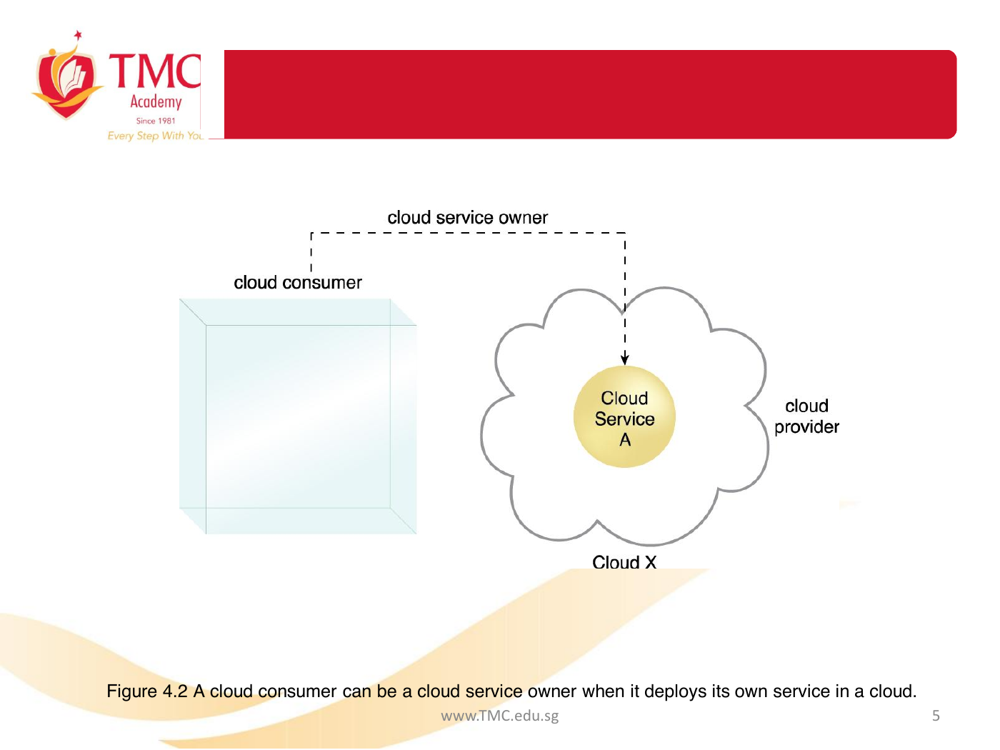

Figure 4.3: A cloud provider becomes a cloud service owner if it deploys its own cloud service, typically for other cloud consumers to use.

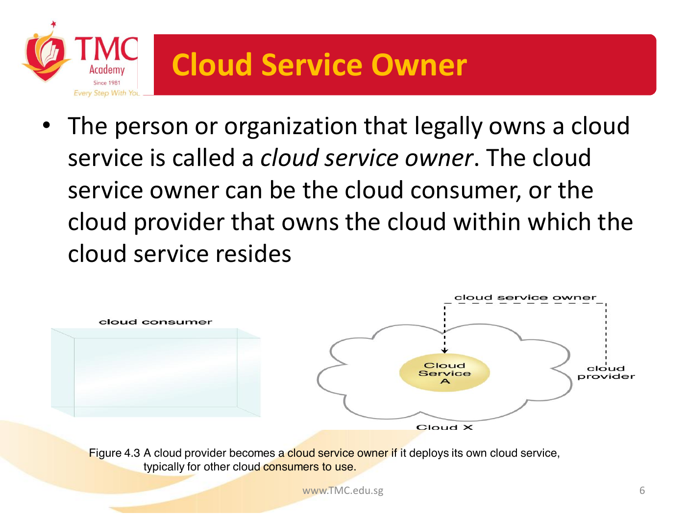

### Page 8-10 - Cloud Resource Administrator

A cloud resource administrator is the person or organization responsible for administering a cloud-based IT resource, including cloud services. The cloud resource administrator can be or belong to the cloud consumer or cloud provider of the cloud within which the cloud service resides. Alternatively, it can be or belong to a third-party organization contracted to administer the cloud-based IT resource.

Figure 4.4: A cloud resource administrator can be with a cloud consumer organization and administer remotely accessible IT resources that belong to the cloud consumer.

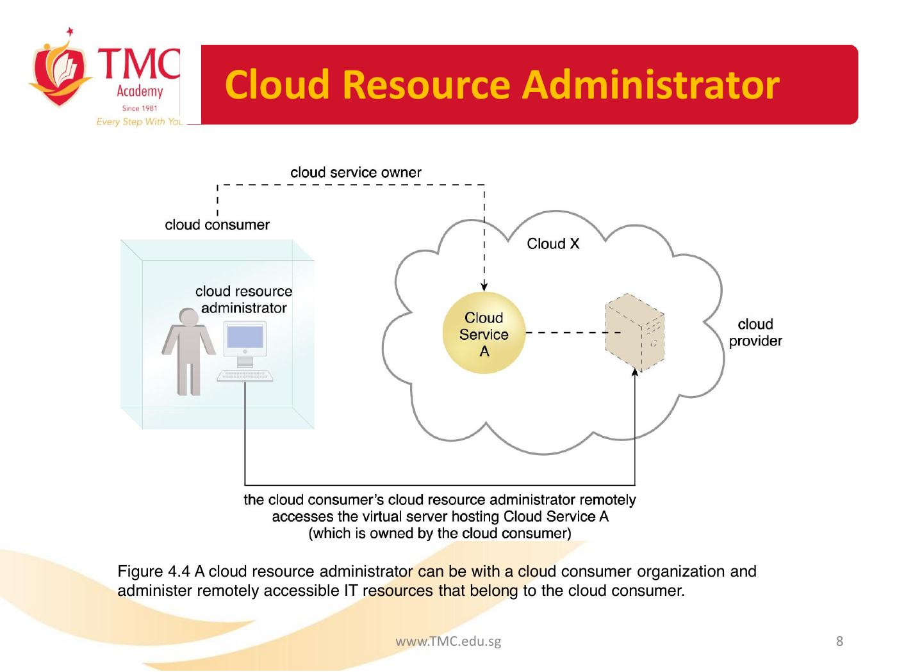

Figure 4.5: A cloud resource administrator can be with a cloud provider organization for which it can administer the cloud provider's internally and externally available IT resources.

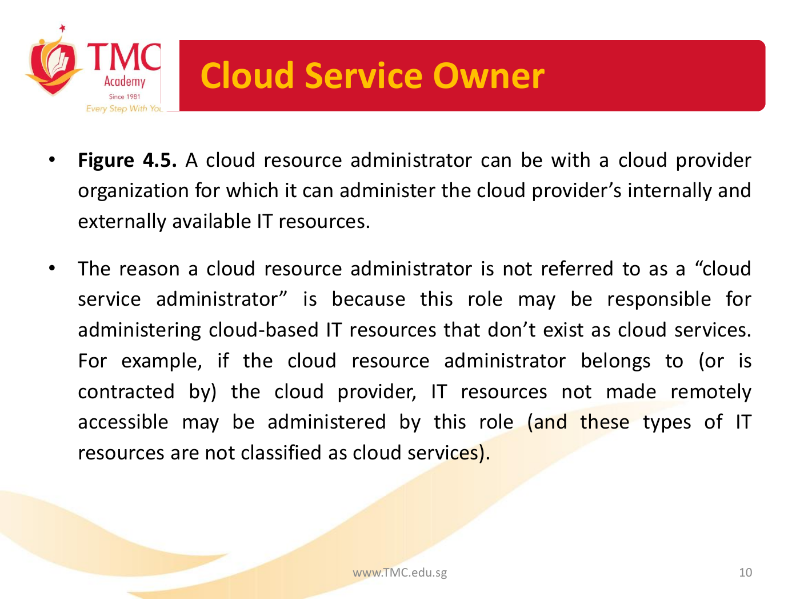

### Page 16 - Cloud Characteristics

The following six specific characteristics are common to the majority of cloud environments:

- on-demand usage
- ubiquitous access
- multitenancy and resource pooling
- elasticity
- measured usage
- resiliency

### Page 18-21 - Single-tenant, multitenant, and resilient system figures

Figure 4.8: In a single-tenant environment, each cloud consumer has a separate IT resource instance.

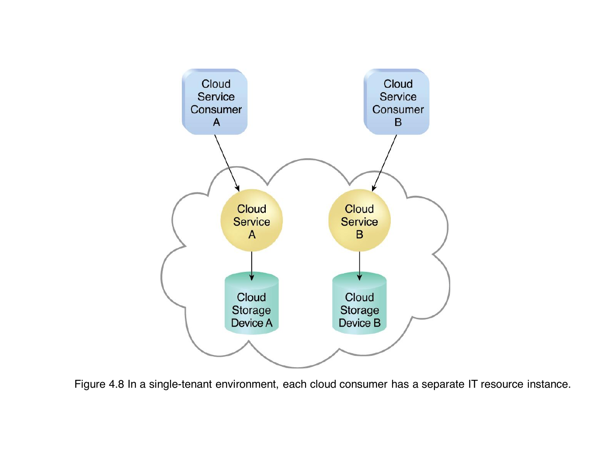

Figure 4.9: In a multitenant environment, a single instance of an IT resource, such as a cloud storage device, serves multiple consumers.

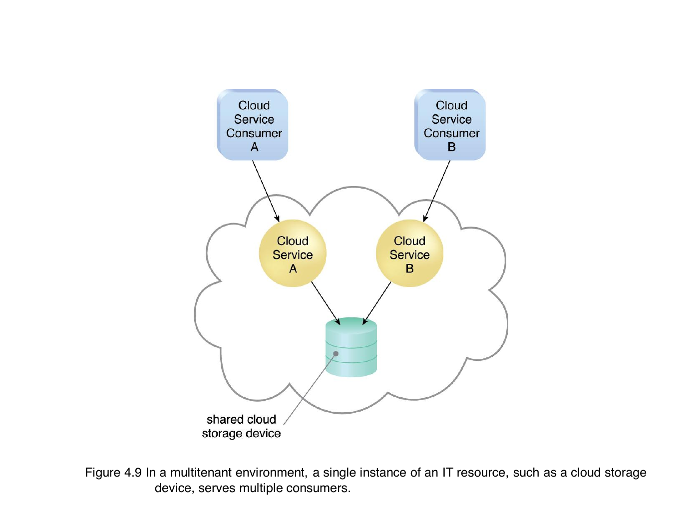

Figure 4.10: A resilient system in which Cloud B hosts a redundant implementation of Cloud Service A to provide failover in case Cloud Service A on Cloud A becomes unavailable.

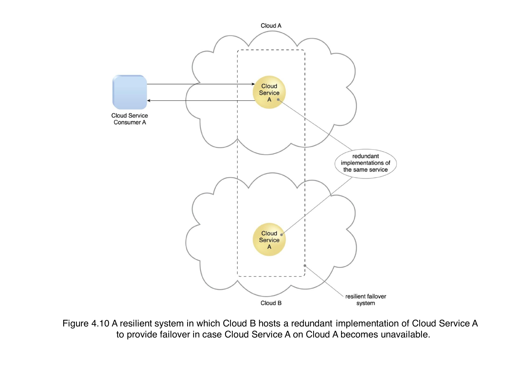

### Page 22 - Cloud Delivery Models

A cloud delivery model represents a specific, pre-packaged combination of IT resources offered by a cloud provider. Three common cloud delivery models have become widely established and formalized:

- Infrastructure-as-a-Service (IaaS)
- Platform-as-a-Service (PaaS)
- Software-as-a-Service (SaaS)

### Page 29 - A comparison of typical cloud delivery model control levels

| Cloud Delivery Model | Typical Level of Control Granted to Cloud Consumer | Typical Functionality Made Available to Cloud Consumer |
| --- | --- | --- |
| SaaS | usage and usage-related configuration | access to front-end user-interface |
| PaaS | limited administrative | moderate level of administrative control over IT resources relevant to cloud consumer's usage of platform |
| IaaS | full administrative | full access to virtualized infrastructure-related IT resources and, possibly, to underlying physical IT resources |

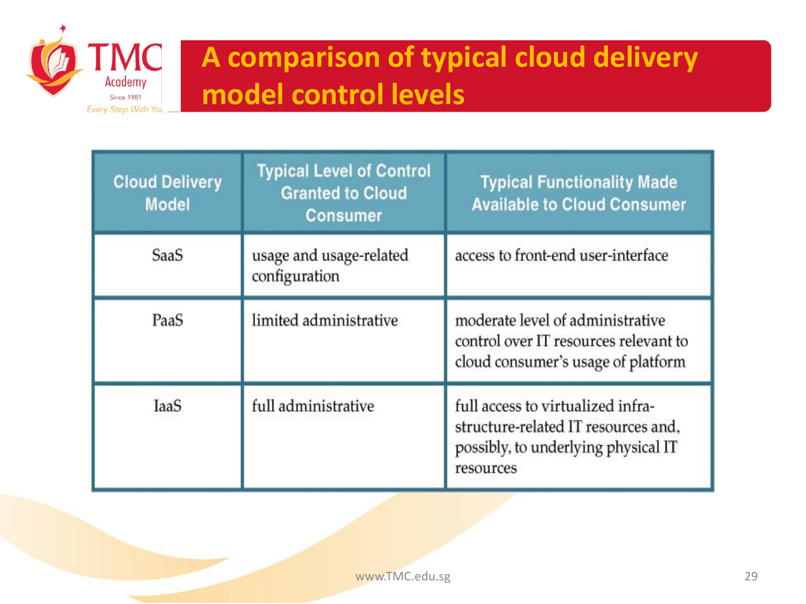

### Page 30 - Typical activities carried out by cloud consumers and cloud providers

| Cloud Delivery Model | Common Cloud Consumer Activities | Common Cloud Provider Activities |
| --- | --- | --- |
| SaaS | uses and configures cloud service | implements, manages, and maintains cloud service; monitors usage by cloud consumers |
| PaaS | develops, tests, deploys, and manages cloud services and cloud-based solutions | pre-configures platform and provisions underlying infrastructure, middleware, and other needed IT resources, as necessary; monitors usage by cloud consumers |
| IaaS | sets up and configures bare infrastructure, and installs, manages, and monitors any needed software | provisions and manages the physical processing, storage, networking, and hosting required; monitors usage by cloud consumers |

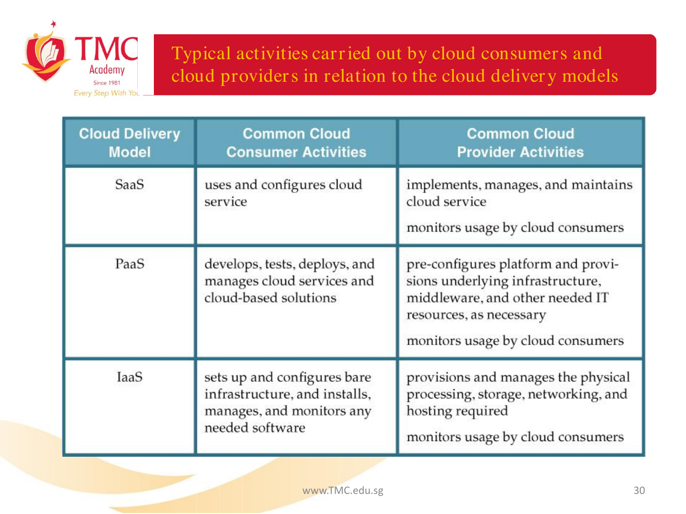

### Page 38 - Cloud Deployment Models

There are four common cloud deployment models:

- Public cloud
- Community cloud
- Private cloud
- Hybrid cloud

## Lecture 3

### Page 6 - Workload Distribution Architecture

In addition to the base load balancer mechanism, and the virtual server and cloud storage device mechanisms to which load balancing can be applied, the following mechanisms can also be part of this cloud architecture:

- Audit Monitor
- Cloud Usage Monitor
- Hypervisor
- Logical Network Perimeter
- Resource Cluster
- Resource Replication

### Page 12-14 - Dynamic Horizontal Scalability Architecture

Figure 11.5: Cloud service consumers are sending requests to a cloud service (1). The automated scaling listener monitors the cloud service to determine if predefined capacity thresholds are being exceeded (2).

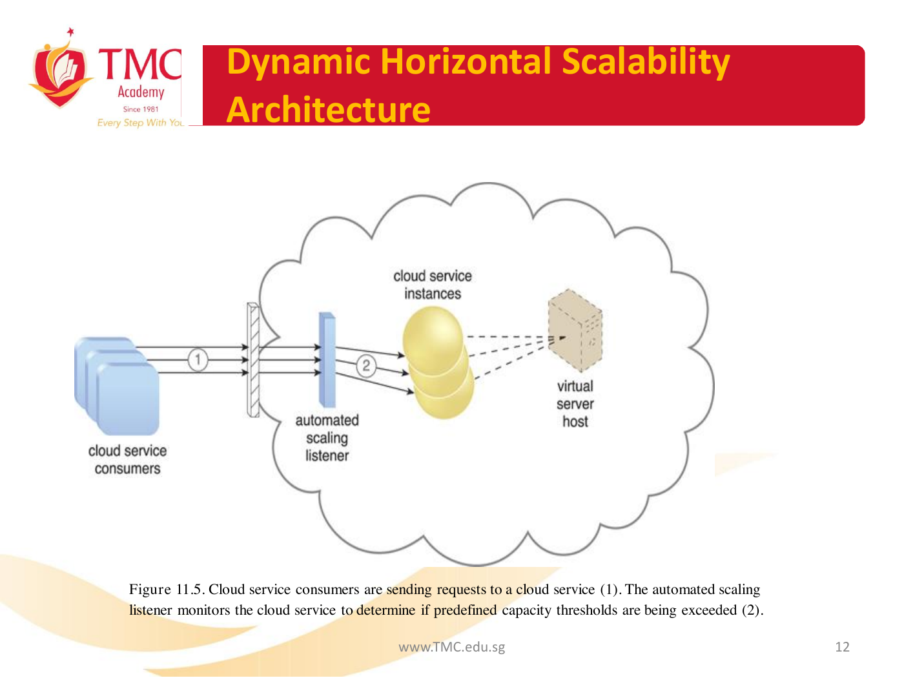

Figure 11.6: The number of requests coming from cloud service consumers increases (3). The workload exceeds the performance thresholds. The automated scaling listener determines the next course of action based on a predefined scaling policy (4). If the cloud service implementation is deemed eligible for additional scaling, the automated scaling listener initiates the scaling process (5).

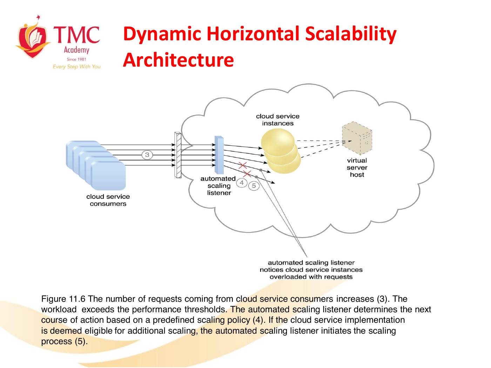

Figure 11.7: The automated scaling listener sends a signal to the resource replication mechanism (6), which creates more instances of the cloud service (7). Now that the increased workload has been accommodated, the automated scaling listener resumes monitoring and detracting and adding IT resources, as required (8).

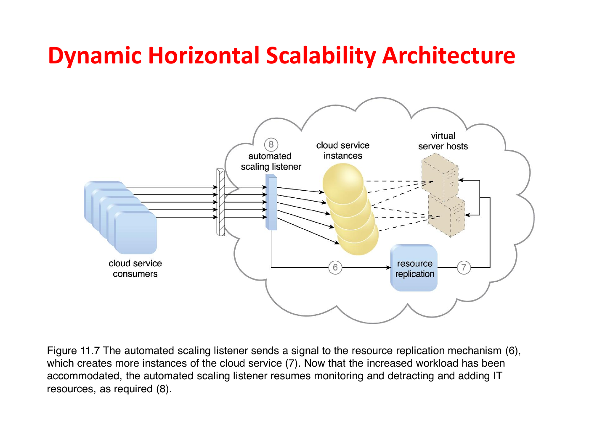

## Lecture 4

### Page 10 - Data Center Technology

Data centres are typically comprised of the following technologies and components:

1. Virtualization
2. Standardization and Modularity
3. Automation
4. Remote Operation and Management
5. High Availability
6. Security-Aware Design, Operation, and Management
7. Facilities
8. Computing Hardware
9. Storage Hardware
10. Network Hardware

### Page 22 - Storage Area Network and Network-Attached Storage

- Storage Area Network (SAN) - Physical data storage media are connected through a dedicated network and provide block-level data storage access using industry standard protocols, such as the Small Computer System Interface (SCSI).
- Network-Attached Storage (NAS) - Hard drive arrays are contained and managed by this dedicated device, which connects through a network and facilitates access to data using file-centric data access protocols like the Network File System (NFS) or Server Message Block (SMB).

## Lecture 5

### Page 5 - Formats for the manipulation and transmission of cloud storage data

- Networked File System - System-based storage access, whose rendering of files is similar to how folders are organized in operating systems (NFS, CIFS)
- Storage Area Network Devices - Block-based storage access collates and formats geographically diverse data into cohesive files for optimal network transmission (iSCSI, Fibre Channel)
- Web-Based Resources - Object-based storage access by which an interface that is not integrated into the operating system logically represents files, which can be accessed through a Web-based interface (Amazon S3)

## Lecture 6

### Page 3-4 - Fundamental security terms relevant to cloud computing

- Confidentiality
- Integrity
- Authenticity
- Availability
- Threat
- Vulnerability
- Risk

### Page 8 - Threat Agents

- Anonymous Attacker
- Malicious Service Agent
- Trusted Attacker
- Malicious Insider

### Page 21 - Risk Management

The main activities are generally defined as risk assessment, risk treatment, and risk control.

- Risk Assessment - In the risk assessment stage, the cloud environment is analyzed to identify potential vulnerabilities and shortcomings that threats can exploit.
- Risk Treatment - Mitigation policies and plans are designed during the risk treatment stage with the intent of successfully treating the risks that were discovered during risk assessment.
- Risk Control - The risk control stage is related to risk monitoring, a three-step process that is comprised of surveying related events, reviewing these events to determine the effectiveness of previous assessments and treatments, and identifying any policy adjustment needs.
